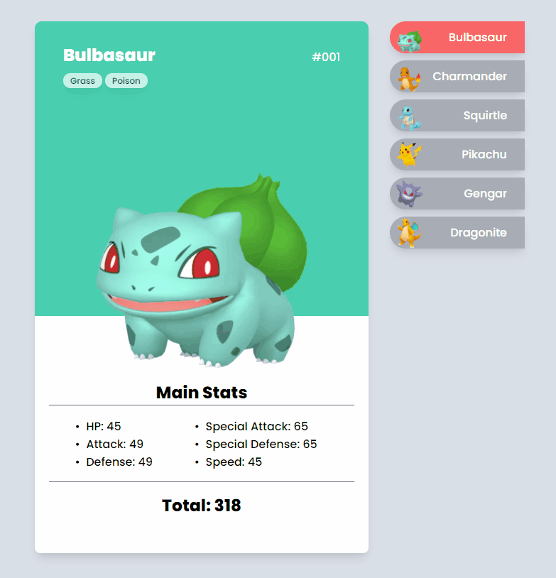

<h1 align="center">
  Desafio: Pokedex
</h1>

  <a href="#-projeto">Projeto</a>&nbsp;&nbsp;&nbsp;|&nbsp;&nbsp;&nbsp;
  <a href="#-tecnologias">Tecnologias</a>&nbsp;&nbsp;&nbsp;|&nbsp;&nbsp;&nbsp;
  <a href="#-layout">Layout</a>&nbsp;&nbsp;&nbsp;|&nbsp;&nbsp;&nbsp;
  <a href="#memo-licença">Licença</a>

 

  

 

## 💻 Projeto

Página que lista alguns Pokemons e detalha informações como o nome, seu identificador, quais suas estatísticas e o total geral deste pokemon.

* Página publicada pode ser vista aqui: [Pokemon layout final](https://brunocs90.github.io/pokedex/).
* Estas informações foram retiradas do site [pokemondb.net](https://pokemondb.net/pokedex/all).
* Página responsiva.
* Buscar as informações a partir do json do projeto (Doing).

## 🚀 Tecnologias

Esse projeto foi desenvolvido com as seguintes tecnologias:

- HTML
- CSS
- JavaScript

## 🔖 Layout

O layout foi proposto durante a semana devemdobro. Entretanto, foram feitos algumas personalizações durante o desenvolvimento.

## :memo: Licença

Esse projeto está sob a licença MIT. Veja o arquivo [LICENSE](LICENSE.md) para mais detalhes.

---
**Desenvolvido por [Bruno César](https://github.com/brunocs90).**
